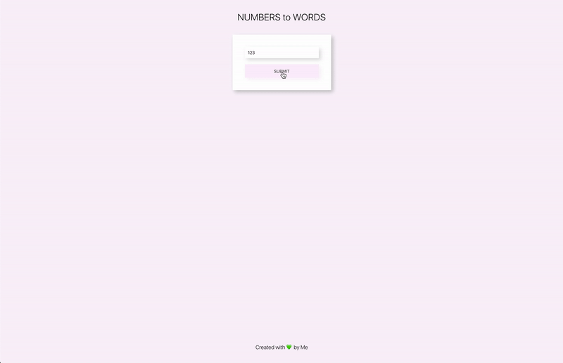

# NUMBERS to WORDS

**A simple app that converts NUMBERS into WORDS.**

[Deployed App Link](https://my-numbers-to-words.web.app/)

**Stack:**
> - React.js;
> - HTML/CSS.

**How to run instructions:**
1. Fork and clone this Project's GitHub repository.  
2. Have current version of Node installed.
3. Open a terminal and navigate into the main Project's directory:
* _Run the command 'npm install' to install dependencies;_
* _Run the command 'npm start' to start frontend server._

**Features:**
- [x] basic numbers to words conversion functionality;
- [x] documentation;
- [ ] unit tests;
- [x] deployment.

**Created by Tatiana Smolin.**
